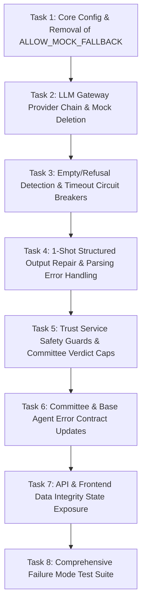

# LLM Safe-Failure Architecture Implementation Plan

> **For Claude:** REQUIRED SUB-SKILL: Use superpowers:executing-plans to implement this plan task-by-task.

**Goal:** Eliminate all mock/fabricated company intelligence fallback from VentureMind, enforce a fail-only-to-real-providers tier with circuit breakers and timeouts, return structured degraded results on parsing failures, guarantee CommitteeAgent never recommends INVEST/PASS on missing evidence, and expose data integrity states transparently to API and frontend.

**Architecture:** Multi-tier resilient LLM gateway (Groq -> Gemini -> OpenRouter -> Cerebras -> Together -> DeepSeek -> Local Ollama -> Terminal `AllLLMProvidersFailedError`). Circuit breaker with in-memory TTL cooldowns for 429/5xx, jittered exponential backoff for transient retries, strict per-call timeouts (8s cloud / 30s local), empty/refusal detection, single-shot JSON repair, and deterministic safety overrides in the trust service capping verdicts to `INCOMPLETE` or `WATCH` when evidence is missing.

**Tech Stack:** Python 3.11+, FastAPI, Pydantic v2, Tenacity, LangGraph, pytest, vanilla JS/CSS.

---

## 1. Files and Functions to Change

| Component | File | Target Symbol / Function | Action |
| :--- | :--- | :--- | :--- |
| **LLM Gateway** | `backend/services/llm_service.py` | `_generate_mock_fallback()` | **DELETE** completely |
| **LLM Gateway** | `backend/services/llm_service.py` | `generate()` | **MODIFY**: remove mock fallback, add empty/refusal/truncation checks, add strict timeouts, failover to real providers, raise `AllLLMProvidersFailedError` |
| **LLM Gateway** | `backend/services/llm_service.py` | `generate_structured()` | **MODIFY**: validate 1-retry repair, enforce Pydantic validation, raise `StructuredOutputParsingError` on exhaustion |
| **LLM Gateway** | `backend/services/llm_service.py` | `generate_chat()` | **MODIFY**: remove hallucinated company mock responses |
| **Config** | `backend/core/config.py` | `Settings` | **MODIFY**: set `ALLOW_MOCK_FALLBACK = False` (deprecated), add `LLM_CLOUD_TIMEOUT_SECONDS = 8.0`, `LLM_LOCAL_TIMEOUT_SECONDS = 30.0`, `PROVIDER_COOLDOWN_SECONDS = 60.0`, `PROVIDER_TRANSIENT_COOLDOWN_SECONDS = 15.0` |
| **Config Env** | `backend/.env.example` & `backend/.env` | `ALLOW_MOCK_FALLBACK` | **MODIFY**: update to `False` |
| **Trust Service** | `backend/services/trust_service.py` | `apply_verdict_safety()` | **MODIFY**: add safety guard: if `confidence == 0.0` or zero included agents, verdict is `INCOMPLETE`; never return `INVEST` or `PASS` under low/zero confidence |
| **Scoring Schemas** | `backend/schemas/scoring.py` | `CommitteeResult` | **MODIFY**: add `data_integrity: str = "verified"`, `evaluation_status: str = "complete"`, add `"INCOMPLETE"` to verdict enum description |
| **Committee Agent** | `backend/agents/committee_agent.py` | `execute()` & `_build_verdict()` | **MODIFY**: set `data_integrity="incomplete"`, `verdict="INCOMPLETE"` on `AllLLMProvidersFailedError` or zero usable agents; narrative generation failure returns factual explanation without hallucinated opportunities/risks |
| **Base Agent** | `backend/agents/base_agent.py` | `execute()` & `_run_with_retry()` | **MODIFY**: handle `StructuredOutputParsingError` and `AllLLMProvidersFailedError` cleanly as degraded `AgentScoreResult` |
| **Scoring Agents** | `backend/agents/{research,market,founder,finance,competitor,risk,prediction}_agent.py` | `run()` | **AUDIT/MODIFY**: ensure no agent has fallback to fabricated scores or fake URLs |
| **API Layer** | `backend/api/analysis.py` | `run_analysis()` | **MODIFY**: expose `data_integrity` and `evaluation_status` in JSON response |
| **Frontend UI** | `venturemind-frontend/venturemind/js/dashboard.js` | `normalizeVerdict()` & `renderReport()` | **MODIFY**: handle `INCOMPLETE` verdict tag, render warning banner when `data_integrity !== 'verified'` |
| **Frontend Style** | `venturemind-frontend/venturemind/css/dashboard.css` | `.verdict-incomplete` | **MODIFY**: add styling for `INCOMPLETE` badge |
| **Test Suite** | `backend/tests/test_llm_failure.py` | `test_llm_service_failure_raises_exception` | **MODIFY**: test failure without forcing setting override |
| **Test Suite** | `backend/tests/test_llm_safe_failure.py` | New comprehensive test suite | **CREATE**: test provider failover, 429 cooldown, timeouts, empty responses, malformed JSON repair, zero-provider failure, verdict safety overrides, zero-fabrication |

---

## 2. Implementation Order



---

## 3. Bite-Sized Implementation Tasks

### Task 1: Core Config & Deprecation of `ALLOW_MOCK_FALLBACK`
**Files:**
- Modify: `backend/core/config.py`
- Modify: `backend/.env.example`
- Modify: `backend/.env`

**Step 1: Write the failing test**
In `backend/tests/test_config_llm_safety.py`:
```python
def test_allow_mock_fallback_is_false_by_default():
    from core.config import settings
    assert settings.ALLOW_MOCK_FALLBACK is False
    assert settings.LLM_CLOUD_TIMEOUT_SECONDS == 8.0
    assert settings.LLM_LOCAL_TIMEOUT_SECONDS == 30.0
```

**Step 2: Run test to verify it fails**
Run: `pytest backend/tests/test_config_llm_safety.py -v`
Expected: FAIL (`ALLOW_MOCK_FALLBACK` is True)

**Step 3: Update `backend/core/config.py` and env files**
- Set `ALLOW_MOCK_FALLBACK: bool = False`
- Add `LLM_CLOUD_TIMEOUT_SECONDS: float = 8.0`
- Add `LLM_LOCAL_TIMEOUT_SECONDS: float = 30.0`
- Add `PROVIDER_COOLDOWN_SECONDS: float = 60.0`
- Add `PROVIDER_TRANSIENT_COOLDOWN_SECONDS: float = 15.0`
- Update `backend/.env` and `backend/.env.example`: `ALLOW_MOCK_FALLBACK=False`

**Step 4: Run test to verify it passes**
Run: `pytest backend/tests/test_config_llm_safety.py -v`
Expected: PASS

---

### Task 2: Complete Removal of Mock Due-Diligence Fallback
**Files:**
- Modify: `backend/services/llm_service.py:531-536` and `backend/services/llm_service.py:612-769`

**Step 1: Write the failing test**
In `backend/tests/test_zero_fabrication.py`:
```python
import pytest
from services.llm_service import llm_service, AllLLMProvidersFailedError
from unittest.mock import patch, MagicMock

@pytest.mark.anyio
async def test_llm_service_never_fabricates_mock_due_diligence():
    with patch.object(llm_service, "_try_groq", side_effect=Exception("Groq down")), \
         patch.object(llm_service, "_try_gemini", side_effect=Exception("Gemini down")), \
         patch.object(llm_service, "_try_openrouter", side_effect=Exception("OpenRouter down")), \
         patch.object(llm_service, "_try_ollama_fallback", side_effect=Exception("Ollama down")):
        
        # When all providers fail, must raise AllLLMProvidersFailedError, NEVER return mock strings
        with pytest.raises(AllLLMProvidersFailedError):
            await llm_service.generate("Analyze company 'Acme Corp' as research analyst", bypass_cache=True)
            
        # Assert _generate_mock_fallback attribute does not exist on llm_service
        assert not hasattr(llm_service, "_generate_mock_fallback")
```

**Step 2: Run test to verify it fails**
Run: `pytest backend/tests/test_zero_fabrication.py -v`
Expected: FAIL (mock fallback exists and returns mock string)

**Step 3: Modify `backend/services/llm_service.py`**
- Delete lines 612–765 (`_generate_mock_fallback`) completely.
- Remove lines 531–535 (the block checking `settings.ALLOW_MOCK_FALLBACK` and returning mock text).
- Directly raise `AllLLMProvidersFailedError("All LLM providers (Gemini, Groq, OpenRouter, Cerebras, Together, DeepSeek, Ollama) failed or are in cooldown.")`.
- In `generate_chat()`, ensure failure raises `AllLLMProvidersFailedError` or returns a factual outage notice: `"The AI assistant is temporarily unavailable because upstream language model services are offline. Please try again shortly."` (Zero fabricated metrics or company evaluations).

**Step 4: Run test to verify it passes**
Run: `pytest backend/tests/test_zero_fabrication.py -v`
Expected: PASS

---

### Task 3: Provider Failover, Cooldown/Circuit-Breakers, Timeouts, and Empty/Refusal Checks
**Files:**
- Modify: `backend/services/llm_service.py`

**Step 1: Write the failing tests**
In `backend/tests/test_provider_resilience.py`:
- `test_empty_or_whitespace_response_rejected()`: provider returning `""` or `"   "` is treated as failure and triggers next provider.
- `test_cloud_provider_timeout()`: provider hanging longer than `settings.LLM_CLOUD_TIMEOUT_SECONDS` times out and triggers next provider.
- `test_rate_limit_sets_cooldown()`: HTTP 429 sets `_provider_cooldown[provider] = time.monotonic() + 60`, subsequent calls immediately skip that provider without network attempt.

**Step 2: Run tests to verify they fail**
Run: `pytest backend/tests/test_provider_resilience.py -v`

**Step 3: Implement resilience in `llm_service.py`**
- Helper function `_validate_response(content: str, provider_name: str) -> str`:
  ```python
  if not content or not content.strip():
      raise ValueError(f"Provider {provider_name} returned empty or whitespace-only content")
  if any(refusal in content.lower() for refusal in ["i cannot fulfill this request", "i am unable to evaluate"]):
      raise ValueError(f"Provider {provider_name} returned a refusal response")
  return content
  ```
- Wrap cloud provider calls in `asyncio.wait_for(..., timeout=settings.LLM_CLOUD_TIMEOUT_SECONDS)`.
- Wrap local Ollama calls in `asyncio.wait_for(..., timeout=settings.LLM_LOCAL_TIMEOUT_SECONDS)`.
- On `asyncio.TimeoutError`:
  ```python
  self._provider_cooldown[provider] = time.monotonic() + settings.PROVIDER_TRANSIENT_COOLDOWN_SECONDS
  self._record_telemetry(provider, model, "timeout", duration * 1000, "Request timed out")
  ```
- On HTTP 429 rate limits: maintain exponential backoff with jitter for max 2 attempts, then set `_provider_cooldown[provider] = time.monotonic() + settings.PROVIDER_COOLDOWN_SECONDS`.

**Step 4: Run tests to verify they pass**
Run: `pytest backend/tests/test_provider_resilience.py -v`
Expected: PASS

---

### Task 4: Strict 1-Shot Structured Output Repair
**Files:**
- Modify: `backend/services/llm_service.py:254-297`

**Step 1: Write the failing test**
In `backend/tests/test_structured_repair.py`:
- `test_structured_repair_succeeds_on_second_attempt()`: first generation returns invalid JSON (`{bad json`), repair prompt returns valid schema JSON -> returns parsed dict.
- `test_structured_repair_exhausted_raises_error()`: both first generation and repair prompt return invalid JSON -> raises `StructuredOutputParsingError` (zero fallback to fake data).

**Step 2: Run test to verify it fails**
Run: `pytest backend/tests/test_structured_repair.py -v`

**Step 3: Modify `generate_structured()`**
- Keep prompt clean and schema-constrained.
- On first JSON parsing error or Pydantic `ValidationError`:
  - Build targeted repair prompt containing `ERROR: {first_error}` and the required JSON structure.
  - Call `self.generate(repair_prompt, bypass_cache=True)`.
  - Parse and validate.
  - If retry fails: raise `StructuredOutputParsingError(f"Failed to generate valid structured JSON after 1 repair attempt: {retry_error}")`.

**Step 4: Run test to verify it passes**
Run: `pytest backend/tests/test_structured_repair.py -v`
Expected: PASS

---

### Task 5: Trust Service Safety Guards & Committee Verdict Caps
**Files:**
- Modify: `backend/services/trust_service.py:58-94`
- Modify: `backend/schemas/scoring.py:213-237`

**Step 1: Write the failing test**
In `backend/tests/test_trust_service_safety.py`:
```python
from services.trust_service import apply_verdict_safety

def test_verdict_safety_caps_to_incomplete_on_zero_confidence():
    safety = apply_verdict_safety(score=0.0, confidence=0.0)
    assert safety.verdict == "INCOMPLETE"
    assert safety.was_overridden is True
    assert "critical evidence unavailable" in safety.override_reason.lower()

def test_verdict_safety_never_allows_invest_or_pass_on_unreliable_data():
    safety_high = apply_verdict_safety(score=85.0, confidence=0.30)
    assert safety_high.verdict != "INVEST"
    assert safety_high.verdict in ("WATCH", "INCOMPLETE")
    
    safety_low = apply_verdict_safety(score=20.0, confidence=0.10)
    assert safety_low.verdict != "PASS"
    assert safety_low.verdict in ("WATCH", "INCOMPLETE")
```

**Step 2: Run test to verify it fails**
Run: `pytest backend/tests/test_trust_service_safety.py -v`
Expected: FAIL (`apply_verdict_safety` returns "WATCH" instead of "INCOMPLETE", or lacks explicit guard)

**Step 3: Update `backend/services/trust_service.py` & `backend/schemas/scoring.py`**
- In `backend/schemas/scoring.py`:
  - Update `CommitteeResult.verdict` description: `"'INVEST' | 'WATCH' | 'PASS' | 'INCOMPLETE'"`.
  - Add `data_integrity: str = Field(default="verified", description="'verified' | 'partial' | 'unverified' | 'incomplete'")`.
  - Add `evaluation_status: str = Field(default="complete", description="'complete' | 'degraded' | 'failed'")`.
- In `backend/services/trust_service.py`:
  - If `confidence == 0.0`:
    ```python
    return VerdictSafetyResult(
        verdict="INCOMPLETE",
        was_overridden=True,
        original_verdict="PASS" if score < 50 else "WATCH",
        override_reason="Verdict set to INCOMPLETE: critical evidence unavailable (0% confidence)."
    )
    ```

**Step 4: Run test to verify it passes**
Run: `pytest backend/tests/test_trust_service_safety.py -v`
Expected: PASS

---

### Task 6: Committee Agent & Scoring Agent Error Contracts
**Files:**
- Modify: `backend/agents/committee_agent.py`
- Modify: `backend/agents/base_agent.py`

**Step 1: Write the failing test**
In `backend/tests/test_committee_safe_degradation.py`:
- `test_committee_returns_incomplete_when_all_agents_fail()`: when all agents return `status="no_data"` or `status="failed"`, `CommitteeAgent.execute()` returns `verdict="INCOMPLETE"`, `final_score=0.0`, `overall_confidence=0.0`, `data_integrity="incomplete"`, `evaluation_status="failed"`.
- `test_committee_narrative_failure_does_not_fabricate()`: when `generate_structured` fails during narrative synthesis, opportunities and risks are empty lists `[]`, narrative states clearly that synthesis could not be completed, score and verdict remain untouched.

**Step 2: Run test to verify it fails**
Run: `pytest backend/tests/test_committee_safe_degradation.py -v`

**Step 3: Implement Committee Agent and Base Agent handling**
- In `backend/agents/committee_agent.py`:
  - If `AllLLMProvidersFailedError` or `not combined.included_agents`:
    - Return `CommitteeResult` with:
      - `verdict="INCOMPLETE"`
      - `final_score=0.0`
      - `overall_confidence=0.0`
      - `data_integrity="incomplete"`
      - `evaluation_status="failed"`
      - `narrative="Due diligence evaluation could not be completed: upstream AI providers were unavailable or failed to produce verified data."`
      - `key_opportunities=[]`, `key_risks=[]`
  - In `_build_verdict`:
    - Set `data_integrity="verified"` if `overall_confidence >= 0.70`, `"partial"` if `0.40 <= overall_confidence < 0.70`, `"incomplete"` if `< 0.40`.
- In `backend/agents/base_agent.py`:
  - Ensure `execute()` gracefully handles `AllLLMProvidersFailedError` and `StructuredOutputParsingError`, returning `make_no_data_result` or `make_failed_result` with clean error messages and 0.0 confidence.

**Step 4: Run test to verify it passes**
Run: `pytest backend/tests/test_committee_safe_degradation.py -v`
Expected: PASS

---

### Task 7: API Response & Frontend Data Integrity UI
**Files:**
- Modify: `backend/api/analysis.py`
- Modify: `venturemind-frontend/venturemind/js/dashboard.js`
- Modify: `venturemind-frontend/venturemind/css/dashboard.css`

**Step 1: Update API endpoint in `backend/api/analysis.py`**
- In `run_analysis()`:
  - Add `"data_integrity": comm_dict.get("data_integrity", "unverified")`
  - Add `"evaluation_status": comm_dict.get("evaluation_status", "complete")`

**Step 2: Update Frontend JavaScript & CSS**
- In `venturemind-frontend/venturemind/js/dashboard.js`:
  - Update `normalizeVerdict()`:
    ```javascript
    function normalizeVerdict(verdict) {
      const val = String(verdict || '').trim().toUpperCase();
      if (val === 'BUY' || val === 'INVEST') return 'INVEST';
      if (val === 'WATCH') return 'WATCH';
      if (val === 'PASS') return 'PASS';
      if (val === 'INCOMPLETE' || val === 'UNABLE_TO_ASSESS') return 'INCOMPLETE';
      return 'WATCH';
    }
    ```
  - In `renderReport()`:
    - If `item.data_integrity === 'incomplete'` or `verdict === 'INCOMPLETE'`:
      - Render an alert banner above the report:
        `⚠️ Evaluation Incomplete: Upstream AI providers were unavailable or unverified. No investment recommendation could be produced.`
      - Render `.verdict-incomplete` badge.
- In `venturemind-frontend/venturemind/css/dashboard.css`:
  - Add `.verdict-incomplete` styling: amber border, subtle dark background (`border: 1px solid rgba(245, 158, 11, 0.4); color: #f59e0b; background: rgba(245, 158, 11, 0.08);`).

---

### Task 8: Comprehensive Verification & End-to-End Test Suite
**Files:**
- Create: `backend/tests/test_llm_safe_failure.py`
- Update: `backend/tests/test_llm_failure.py`

**Tests Included in Suite:**
1. `test_provider_failover_gemini_to_groq()`
2. `test_rate_limiting_cooldown_and_jittered_backoff()`
3. `test_timeout_handling_fails_fast_to_next_provider()`
4. `test_empty_and_refusal_responses_trigger_failover()`
5. `test_single_structured_repair_attempt_succeeds()`
6. `test_exhausted_structured_repair_returns_failed_result()`
7. `test_all_providers_unavailable_raises_clean_exception()`
8. `test_committee_never_issues_invest_or_pass_without_evidence()`
9. `test_zero_mock_data_leakage()`: verifies prompt for unknown company never returns AWS CTO, $1.8M ARR, or fake techcrunch/sec.gov citations.

---

## 4. Migration & Config Implications

- **Environment Configuration:**
  - `ALLOW_MOCK_FALLBACK` is permanently defaulted to `False`.
  - Existing `.env` files with `ALLOW_MOCK_FALLBACK=True` will be ignored or forced to `False` in production runtime.
- **Database Schema:**
  - `analyses` table stores `committee_result` JSON directly. The addition of `data_integrity` and `evaluation_status` keys is non-breaking and backwards-compatible with existing SQLite/PostgreSQL rows.

---

## 5. Risks & Mitigation

| Risk | Impact | Mitigation Strategy |
| :--- | :--- | :--- |
| **All cloud providers down simultaneously** | Analysis returns `INCOMPLETE` with 0.0 score | Transparent degradation: user receives honest notification rather than hallucinatory advice. Local Ollama serves as offline Tier 3 if available. |
| **Schema repair prompt latency** | Additional 1–3s latency on malformed model responses | Cap repair at exactly 1 attempt with a compact diff-only repair prompt. Bypass cache to prevent poisoned caching. |
| **Frontend breaks on new `INCOMPLETE` verdict** | UI rendering glitch | `normalizeVerdict()` explicitly maps `INCOMPLETE`, and fallback defaults to `WATCH` safely. Full badge CSS provided. |

---

## 6. Rollback Considerations

- If any unexpected provider behavior occurs during roll-out, individual providers can be disabled cleanly via existing environment variables (`GROQ_API_KEY=""`, `GEMINI_API_KEY=""`, etc.).
- Changes are modular: `trust_service.py` rules and `llm_service.py` provider wrappers maintain existing method signatures (`generate`, `generate_structured`, `generate_chat`), ensuring zero breaking changes for workflow consumers.
